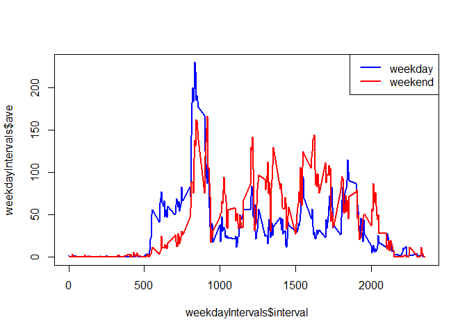

## Setup


```r
knitr::opts_chunk$set(echo = TRUE)

library(dplyr)
```

```
## 
## Attaching package: 'dplyr'
```

```
## The following objects are masked from 'package:stats':
## 
##     filter, lag
```

```
## The following objects are masked from 'package:base':
## 
##     intersect, setdiff, setequal, union
```


## Loading and preprocessing the data

Here we load the activity data.


```r
data <- read.csv(unz("activity.zip","activity.csv"))
```


## What is mean total number of steps taken per day?

Here we compute a data frame with the total steps per day. For any interval with unavailable data, we will assume 0 steps here. 


```r
daySteps <- data %>% group_by(date) %>% summarize(steps = sum(steps,na.rm = TRUE))
```

Here we give some results for the total steps per day - a histogram and the mean and median steps per day


```r
hist(daySteps$steps,main="Total Steps per Day Histogram",xlab="Total Steps")
```

<!-- -->
Here we look at the mean and median for the total steps each day.


```r
meanStepsPerDay <- mean(daySteps$steps)
medianStepsPerDay <- median(daySteps$steps)
```

__Mean Steps per Day:__ 9354.2295082

__Median Steps per Day:__ 10395

## What is the average daily activity pattern?


Here we compute a data frame with the total steps grouped by interval in the day. For intervals with missing data, 0 sets is assumed here.


```r
intervalSteps <- data %>% group_by(interval) %>% summarize(ave = mean(steps,na.rm = TRUE))
```

We make a time series plot of the average number of steps for each interval.


```r
plot(intervalSteps$interval,intervalSteps$ave,type="l")
```

<!-- -->


```r
maxAveInterval = intervalSteps$interval[which.max(intervalSteps$ave)]
```

__Which 5-minute interval, on average across all the days in the dataset, contains the maximum number of steps?__

__Interval with largest average:__ 835

## Imputing missing values

We want to examine the missing values.


```r
totalMissing <- sum(is.na(data$steps))
totalNotMissing <- sum(!is.na(data$steps))

#this is a data frame with the nubmer of missing and not missing values
missingByDay <- data %>% group_by(date) %>% summarize(missing = sum(is.na(steps)), notmissing = sum(!is.na(steps)))

uniqueDayNonMissing <- unique(missingByDay$notmissing)
```

__Total Missing Values:__ 2304

__Total Values _not_ Missing:__ 15264

__Number of Non-missing values per Day, unique values:__ 0, 288

From the last value above, we see that days are either fully populated or not populated at all.

To impute values, we will replace an interval with the mean number of steps in that interval taken over all days.


```r
# we will create a vector of average steps per interval to align with the rows
# of the data vector.
intervalAveSteps <- rep(intervalSteps$ave,61)
intervalValue <- rep(intervalSteps$interval,61)

# Test to make sure our vectors align!
valuesAlign = sum(intervalValue != data$interval) == 0
if(!valuesAlign) {
  error("The values did not align!")
}

## now create the modified data
missingData <- is.na(data$steps)
imputedData <- data

imputedData$steps[missingData] <- intervalAveSteps[missingData]
```

### Repeat of total steps per day analysis with imputed data

We will now repeat our analysis above with the imputed data for total steps per day.


```r
imputedDaySteps <- imputedData %>% group_by(date) %>% summarize(steps = sum(steps))
```

Here we give some results for the total steps per day - a histogram and the mean and median steps per day


```r
hist(imputedDaySteps$steps,main="Total Steps per Day Histogram",xlab="Total Steps")
```

<!-- -->
Here we look at the mean and median for the total steps each day.


```r
imputedMeanStepsPerDay <- mean(imputedDaySteps$steps)
imputedMedianStepsPerDay <- median(imputedDaySteps$steps)
```

__Mean Steps per Day:__ 1.0766189\times 10^{4}

__Median Steps per Day:__ 1.0766189\times 10^{4}

This might look suspicious at first glance that the mean and median are the same,
but we added a number of days containing exactly the mean number of steps. The 
median value must have fallen in this range of "fixed" data.

### Conclusion Regarding Imputed Data

When we treated the missing data as being equivalent to 0 we added several days
with very little motion. In effect, when we did not impute the data we had
several days with artificially low motion.

__Do these values differ from the estimates from the first part of the assignment?__

Adding the imputed data gave a higher values for total steps as well as for the
mean and median.

__What is the impact of imputing missing data on the estimates of the total daily number of steps?__

The total number of steps per day is higher.


## Are there differences in activity patterns between weekdays and weekends?


```r
modData <- imputedData

modData$date <- as.Date(modData$date,"%Y-%m-%d")

dayOfWeek <- weekdays(modData$date)
isWeekend <- (dayOfWeek == "Saturday") | (dayOfWeek == "Sunday")
dayTypeChar <- rep("weekday",length(modData$date))
dayTypeChar[isWeekend] = "weekend"

modData$daytype <- factor(dayTypeChar)
```


```r
modIntervalSteps <- modData %>% group_by(interval,daytype) %>% summarize(ave = mean(steps,na.rm = TRUE))
```

```
## `summarise()` has grouped output by 'interval'. You can override using the
## `.groups` argument.
```

We make a time series plot of the average number of steps for each interval.


```r
library(ggplot2)

ggplot(modIntervalSteps,aes(interval,ave)) + geom_line() + facet_grid(daytype ~ .)
```

<!-- -->


```r
weekdayIntervals <- filter(modIntervalSteps,daytype == "weekday")
weekendIntervals <- filter(modIntervalSteps,daytype == "weekend")

plot(weekdayIntervals$interval,weekdayIntervals$ave,type="l",col="blue",lwd=2)
lines(weekendIntervals$interval,weekendIntervals$ave,type="l",col="red",lwd=2)
legend("topright",legend=c("weekday","weekend"),col=c("blue","red"),lwd=2)
```

<!-- -->
